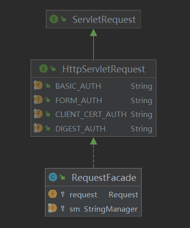

# 😼 高级设计意图分析

> 在这章，我们将从用法和用途两个方面深入探讨Tomcat中运用的一些设计模式

## 工厂模式

> 主要用来实例化有共同接口的类，工厂模式可以动态决定应该实例化那一个类。

根据上一章的处理请求的时序图，我们可知Context的Valve调用到最后一个后，会继续调用Wrapper的第一个Valve，这时会先创建对应`servlet`的`filterChain`，然后调用指定的`servelt`实例来处理。\
实际上，这里的filterchain便是用工厂实例来生成的。

```
// Create the filter chain for this request
        ApplicationFilterChain filterChain =
                ApplicationFilterFactory.createFilterChain(request, wrapper, servlet);
```

## 外观模式

> 为子系统中的一组接口提供一个一致的界面，此模式定义了一个高层接口，这个接口使得这一子系统更加容易使用

这种设计模式在Tomcat的源码种随处可见。Tomcat在设计上是通过不同的组件组合而成，外观模式能够隔离这些组件私有的数据。

<figure><figcaption><p>RequestFacade的类关系图</p></figcaption></figure>

如上图所示，RequestFacade作为Request的门面，内部包含Request对象;除此之外还有ResponseFacade作为Response的门面，内部包含Response对象和 ApplicationContextFacade作为ApplicationContext的门面，内部包含ApplicaitonContext对象等等。

```java
// RequestFacade中的部分方法
    public RequestFacade(Request request) {

        this.request = request;

    }
    @Override
    public Object getAttribute(String name) {

        if (request == null) {
            throw new IllegalStateException(
                            sm.getString("requestFacade.nullRequest"));
        }

        return request.getAttribute(name);
    }


    @Override
    public Enumeration<String> getAttributeNames() {

        if (request == null) {
            throw new IllegalStateException(
                            sm.getString("requestFacade.nullRequest"));
        }

        if (Globals.IS_SECURITY_ENABLED){
            return AccessController.doPrivileged(
                new GetAttributePrivilegedAction());
        } else {
            return request.getAttributeNames();
        }
    }
```

可以看到，需要使用Request的时候，使用的具体的类是具体的类是`RequestFacade`

## 责任链模式

> 为了避免请求发送者与多个请求处理者耦合在一起，将所有请求的处理者通过前一对象记住其下一个对象的引用而连成一条链；当有请求发生时，可将请求沿着这条链传递，直到有对象处理它为止。

实际上，这个模式在上一章的最后的请求处理流程的时序图中就充分体现了。在Tomcat中，每个Container组件采用责任链模式来完成具体的请求处理，其中接口Pipeline 用于构建责任链，接口 Valve则代表了责任链上的处理器。下面是它的具体处理流程：

1. 请求被`Connector`组件接收，Connector根据请求创建对应的`Request`和`Response`对象作为**责任**。
2. `Connector`将**责任**交给`Container`,先通过`Engine`的`pipeline`组件流经内部的每个`Valve`。
3. `Host`的`pipeline`组件收到**责任**，在经过内部`Valve`的过滤后传递给下一个阀门。
4. `Context`的`pipeline`组件收到**责任**，在经过内部`Valve`的过滤后传递给下一个阀门。
5. Wrapper的`pipeline`组件收到**责任**，在经过内部`Valve`的过滤后传递给下一个阀门。
6. `Wrapper`内部的`WrapperValve`创建`FilterChain`实例，调用指定的`Servlet`实例处理请求。
7. 返回

