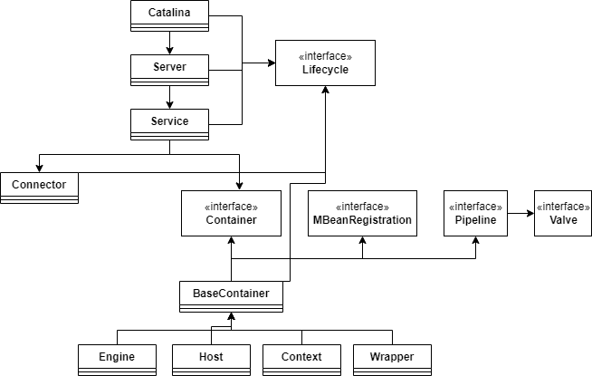
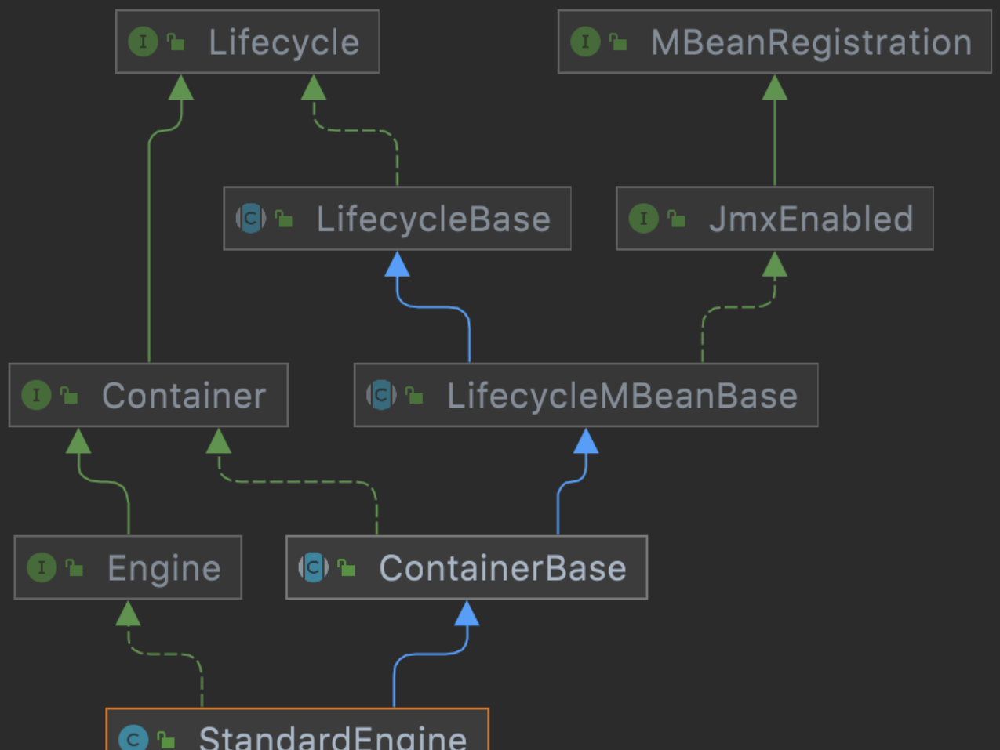
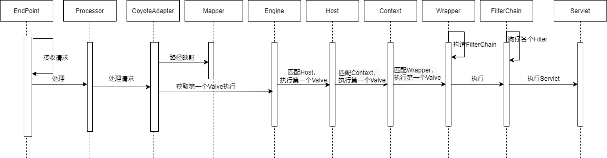

# 😻 核心流程设计分析

## 核心类结构图

<figure><figcaption><p>核心类结构图</p></figcaption></figure>

上述核心类的功能我们在序言中就有所提及。Catalina与开始/关闭shell脚本交互的主类，Serve是整个Tomcat组件的容器，包含一个或多个Service。Service是包含Connector和Container的集合，多个 Connector 和一个 Container 就形成了一个 Service。Service用适当的Connector接收用户的请求，再发给相应的Container来处理。Catalina、Service和Server都通过Lifecycle接口管理生命 周期，这其中还涉及到观察者这一设计模式的应用。Connector是实现某一网络协议的连接器，可以接收网络请求。Container则是处理某类型请求的容器，把处理请求的处理器包装为Valve对象，并按一定顺序放入类型为Pipeline的管道里。Engine包含Host（虚拟主机）和Context（具体Web应用的上下文，每个请求都在是相应的上下文里处理的），接到请求后仍给相应的Host在相应的Context里处理。最后的Wrapper是针对每个Servlet的Container，每个Servlet都有相应的Wrapper来管理。可以看到，上述的这些核心组件的作用范围是逐层递减，同时逐层包含。

## 面向对象设计原则


面向对象六大设计原则

**1. 单一职责原则（Single Responsibility Principle）**

类发生更改的原因应该只有一个

**2. 里氏替换原则（Liskov Substitution Principle）**

超类存在的地方，子类是可以替换的。

**3. 依赖倒置原则（Dependence Inversion Principle）**

实现尽量依赖抽象，不依赖具体实现。

**4. 接口隔离原则（Interface Segregation Principle）**

应当为客户端提供尽可能小的单独的接口，而不是提供大的总的接口。

**5. 开闭原则（Open Close Principle）**

面向扩展开放，面向修改关闭。

**6. 组合/聚合复用原则（Composite/Aggregate Reuse Principle CARP）**

尽量使用合成/聚合达到复用，尽量少用继承。原则： 一个类中有另一个类的对象。


```java
// Engine接口
public interface Engine extends Container {
    /**
     * @return the default host name for this Engine.
     */
    public String getDefaultHost();
    /**
     * Set the default hostname for this Engine.
     *
     * @param defaultHost The new default host
     */
    public void setDefaultHost(String defaultHost);
    /**
     * @return the JvmRouteId for this engine.
     */
    public String getJvmRoute();
    /**
     * Set the JvmRouteId for this engine.
     *
     * @param jvmRouteId the (new) JVM Route ID. Each Engine within a cluster
     *        must have a unique JVM Route ID.
     */
    public void setJvmRoute(String jvmRouteId);
    /**
     * @return the <code>Service</code> with which we are associated (if any).
     */
    public Service getService();
    /**
     * Set the <code>Service</code> with which we are associated (if any).
     *
     * @param service The service that owns this Engine
     */
    public void setService(Service service);
}
```

以Engine接口的定义为例，可以看到getDefaultHost方法就只负责返回Engine的主机名，每个方法都只负责一件事情。整个Engine类的责任就是将用户请求分配给一个虚拟上机处理。符合**单一职责原则**在方法层面和类层面的应用。

<figure><figcaption><p>StandardEngine类的依赖关系</p></figcaption></figure>

从Engine的实现类StandardEngine的依赖关系图中可以看到**依赖倒置原则**的运用，即依赖抽象来编写代码，Engine的实现类依赖于Engine接口和抽象类ContainerBase，最终依赖于Lifecycle和MBeanRegistration接口。StandardEngine类的实现依赖于Engine、Contianer、Lifecycle等小接口，也体现出了**接口隔离原则**。从最上面的核心类结构图也可以看出，每一个实现类都依赖于几个不同的接口。在这里StandardEngine是一个生命周期的类，实现了Lifecycle，也是一个容器，实现了Container，通过组合/聚合达到了复用，符合**组合/聚合复用原则。**

Tomcat的设计中处处体现着面向对象思想，仅以Engine组件为例，我们就可以发现大部分的面向对象设计原则。


## 请求处理流程

<figure><figcaption><p>处理请求流程时序图</p></figcaption></figure>

Tomcat的整体架构中，我们发现Tomcat中的各个组件遵守了“高内聚，低耦合的原则”，保证了了Tomcat整体架构的可伸缩性和可拓展性。除此之外， 在Tomcat中，每个Container组件采用责任链模式来完成具体的请求处理。增强了组件的灵活性和拓展性。Tomcat中定义了Pipeline 和 Valve两个接口，Pipeline 用于构建责任链， Valve则代表了责任链上的处理器。Pipeline会维护一个基础的Valve，它位于Pipeline的执行顺序的末端 ，封装了具体的请求处理和输出响应的过程。Pipiline通过获得首个Valve来启动整合链条的执行 。
