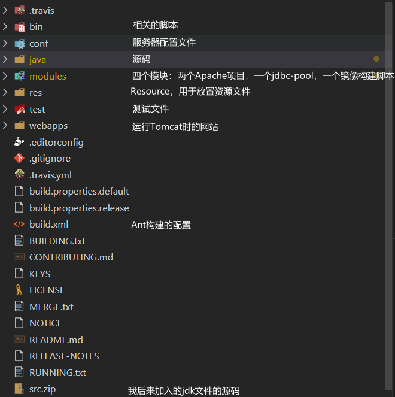
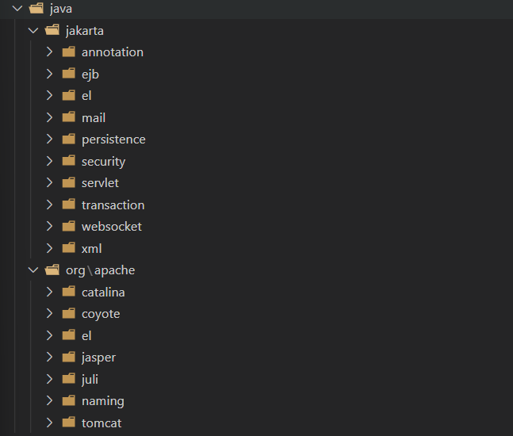
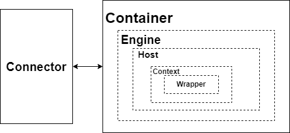
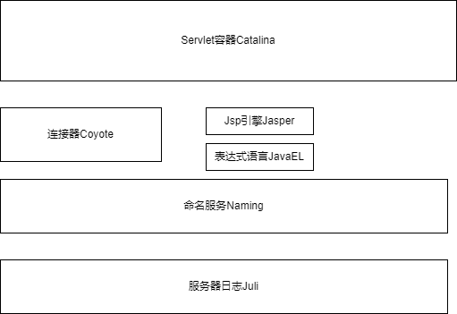

# 序言

本文是一篇Tomcat源码阅读报告，产生自中国科学院大学“面向对象程序设计”的课程作业。旨在对Tomcat项目进行一个总体的介绍和分析，并对其中最重要的连接器和容器模块进行细致的分析和讲解。如有错漏，敬请告知。

### Tomcat简介

根据[Tomcat官网](https://tomcat.apache.org/)上的介绍，Apache Tomcat®软件是Jakarta Servlet、Jakarta Server Pages、Jakarta Expression Language、Jakarta WebSocket、Jakarta Annotations和Jakarta Authentication规范的一个开源实现。这些规范是Jakarta EE平台的一部分。具体来讲，Tomcat是Apache 服务器的扩展，但它同时也是独立运行的，按照Servlet规范的要求实现的Servlet容器，还具有传统的Web服务器的功能，能够处理Html页面。总而言之，它同时拥有两种身份：**Http服务器**和**Servlet容器**。

### Tomcat的目录结构

在[Tomcat官网](https://tomcat.apache.org/)上，我们可以获取它的源码。我采用vscode这一IDE作为分析源码的工具。将源码文件夹用vscode打开，可以看到源码的目录结构如下：

<figure><figcaption></figcaption></figure>

我对部分重要的文件夹做出了注释，最下面的是src.zip是我导入的jdk源码，使得vscode能够对一些用到jdk相关的API的函数产生索引。与Tomcat本身实现相关的文件被放置在了java文件夹中，打开java文件夹中后我们可以看到：

<figure><figcaption></figcaption></figure>

java文件夹下面有两个子文件夹：jakarta和org\apache。在jakarta中存放的是Java EE规范，org\apache中存放的是这些规范的实现。

Java EE规范具体可以参考[官网](https://jakarta.ee/specifications/)，本文重点关注的是规范实现部分，即org\apache中存放的代码。

<figure><figcaption></figcaption></figure>

这些便是构成tomcat的主要模块，其中最重要的是**Catalina**和**Coyote**，作为**Servlet容器**和**连接器**构成了Tomcat所具备的**Http服务器**和**Servlet容器**两大身份。在接下来的Tomcat主要功能模块的部分，我还会对这几个模块做一个更为深入的讲解。

### Tomcat主要功能

Tomcat主要的功能有：

1. 与Http服务器类似，绑定IP地址并监听TCP端口
2. 管理Servlet程序的生命周期
3. 将URL映射到指定的Servlet进行处理
4. 与Servlet程序合作处理HTTP请求——根据HTTP请求生成HttpServletRequest/Response对象并传递给Servlet进行处理，将Servlet中的HttpServletResponse对象生成的内容返回给浏览器

通过Tomcat，我们可以在服务器上部署Java应用，客户端可以通过相应IP地址（或域名）和端口来获取资源。

### Tomcat工作流程

当客户端向服务器发送请求时（不妨设为请求某个URL资源），Tomcat的工作流程如下：

1. Http服务器将请求信息用ServletRequest对象封装
2. Servlet获得请求后，根据URL和Servlet的映射关系，调用Servlet容器中相应Servlet处理请求（如果Serlet还没有被加载，那么需要根据java的反射机制创建Servlet，并调用其自身的init方法来初始化）
3. 将请求的处理结果用ServletResponse对象封装
4. 把封装后的处理结果返回给Http服务器，随后Http服务器会将处理结果发送给客户端

### Tomcat主要功能模块

通过上面的工作流程可以看到，Tomcat本质上同时实现了**Http服务器**和**Servlet容器**两种核心功能。在Tomcat的架构中，最核心的就是实现Http服务器功能的**连接器**（Connector）**和实现Servlet容器功能的容器**（Container）两大模块。连接器能够处理Socket连接，实现网络字节流与Request和Response对象的转化。容器能够加载和管理Servlet，并调用Servlet处理Request请求。据此粗略画出的Tomcat总体框架结构图：

<figure><figcaption></figcaption></figure>

连接器（Connector）的名称是Coyote，容器（Container）的名称是Catalina，除了这两个主要模块外，还有提供JSP引擎的Jasper模块，提供JNDI服务的Naming模块，提供日志服务的Juli模块等等。这些模块共同组成了Tomcat：

<figure><figcaption></figcaption></figure>
