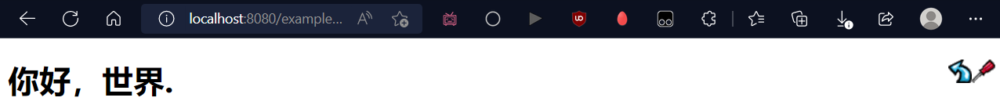
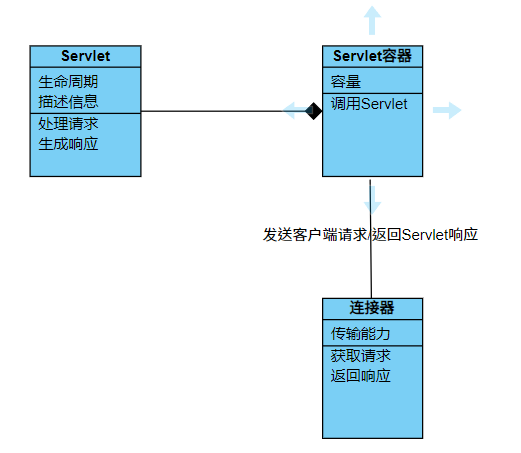

# 主要功能分析与建模

### 主要功能

在序言中我们便介绍了Tomcat的主要功能——Servlet容器和处理html页面。处理html不是其最主要和特有的功能，因此本文分析的重点是其作为Servlet容器的功能。

### 简单实例

展示Tomcat自带的一个简单实例：在本机的8080端口上部署一个webapp，打印“你好，世界”到页面上


```java
Source Code for HelloWorld Example
import java.io.*;
import jakarta.servlet.*;
import jakarta.servlet.http.*;

public class HelloWorld extends HttpServlet {

    public void doGet(HttpServletRequest request, HttpServletResponse response)
    throws IOException, ServletException
    {
        response.setContentType("text/html");
        PrintWriter out = response.getWriter();
        out.println("<html>");
        out.println("<head>");
        out.println("<title>Hello World!</title>");
        out.println("</head>");
        out.println("<body>");
        out.println("<h1>Hello World!</h1>");
        out.println("</body>");
        out.println("</html>");
    }
}
```


显示效果为：

<figure><figcaption><p>浏览器画面</p></figcaption></figure>

### 需求建模

利用上述实例使用实例法对Tomcat进行需求分析，建立需求模型，包含（正常处理、异常处理和替代处理）


```
【用例名称】
 你好，世界
 【场景】
 who：用户（客户端），服务器
 where：客户端页面
 when：打开页面
 【用例描述】
 1.客户端向服务器发送请求
 2.服务器通过连接器收到请求后将请求信息用ServletRequest对象封装
 3.根据URL和Servlet的映射关系，调用服务器（Servlet容器）中相应Servlet处理请求
 3.Servlet将请求的处理结果用ServletResponse对象封装
 4.把处理结果通过连接器返回给Http服务器
 5.Http服务器将处理结果发送到客户端
   5.1 接受数据或响应数据时出现了错误，抛出IOException
   5.2 数据的逻辑处理时出现了异常吗，抛出ServletException
 6.客户端显示收到的静态网页
 【用例价值】
 服务器处理用户的请求，用户通过客户端获得请求的内容，使得服务器的本地文件能被用户获得
 【约束和限制】
 1.响应内容符合html规范
 2.网络不会中断
 3.服务器能够回应请求
 4.服务器带宽能够容纳请求
```


为了从上面的需求模型中提取类，我抓取了关键的名词和动词，形成了下面的表格

| 类         | 属性        | 方法        |
| --------- | --------- | --------- |
| Servlet   | 生命周期，描述信息 | 处理请求，生成响应 |
| Servlet容器 | 容量        | 调用Servlet |
| 连接器       | 传输能力      | 获取请求，返回响应 |

根据上面的表格画出一个简单的类图，Servlet和Servlet容器之间是聚合的关系，Servlet容器和连接器之间是简单的关联关系。

<figure><figcaption></figcaption></figure>

### 实例代码分析

结合从需求模型中提取出来的类模型，我们可以深入地阅读上面的简单实例的代码

源代码导入了三个包，分别是java.io,jakarta.servlet和jakarta.servlet.http，java.io中包含用于对IO流的类和方法，后两者表示servlet api的接口和类。

随后，它构造了一个继承自HttpServlet类的HelloWorld类。HttpServlet类来自javax.servlet.http包，它扩展了`GenericServlet`类并实现了`Serializable`接口。

在HelloWorld类中的doGet方法便调用HttpServlet类，允许Servlet处理GET请求，生成response对象。

在收到请求后，response对象先调用setContentType方法设置内容类型为html，再调用getWriter()方法，返回一个声明为out的PrintWriter类的对象，out调用PrintWriter自带的println按行输出html语句

在这个过程中，最重要的部分便是调用doGet方法，doGet方法的定义如下，我么可以看到它包含两个参数，HttpServletRequest类型的请求req和HttpServletResponse的响应resp。sendMethodNotAllowed方法主要针对于提交方法的类型错误，属于一种异常处理。


```java
    protected void doGet(HttpServletRequest req, HttpServletResponse resp)
        throws ServletException, IOException
    {
        String msg = lStrings.getString("http.method_get_not_supported");
        sendMethodNotAllowed(req, resp, msg);
    }
```



```java
public interface HttpServletRequest extends ServletRequest
public interface HttpServletResponse extends ServletResponse 
```


我们可以看到这两种类型是继承自ServletRequest和ServletResponse 的接口，通过对这两种接口的定义的阅读，我们可以发现它们的功能。`ServletRequest`的对象用于向Servlet提供客户端请求信息，如内容类型，内容长度，参数名称和值，标题信息，属性等。此时会把请求信息封装成`resquest`对象。doGet方法下面的代码提供了对于响应的设置，Servlet从中获取设置内容组装一个http响应来组成ServletResponse的对象的内容。

在这一部分基本只谈到了Servlet容器根据请求调用Servlet和Servlet对于请求的处理和响应的生成，与连接器有关的部分是请求的接收和响应的发送，在这一实例中并不能充分体现。
